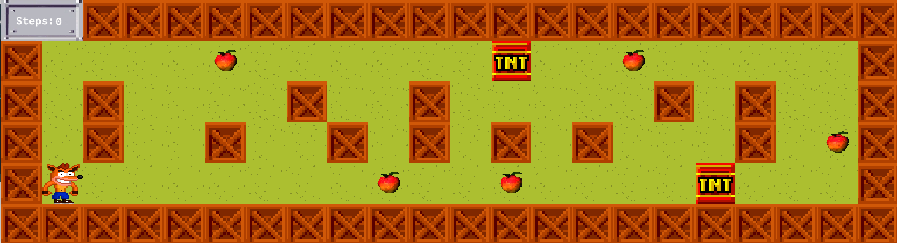

# Jogo 2D em C com MLX42



## Descrição
Este projeto é um jogo 2D desenvolvido em C utilizando a biblioteca gráfica MLX42 da Codam. O objetivo é controlar um personagem, coletar itens no mapa e alcançar a saída para progredir nos níveis.

## Funcionalidades
- **Personagem:** Controle de um personagem movendo-se pelo mapa(setas ou WASD).
- **Itens:** Itens espalhados no mapa para o personagem coletar.
- **Saída:** O objetivo é levar o personagem até a saída para concluir o nível.
- **Mapa:** Implementação de diversas validações.
- **Inimigo:** Inimigos espalhados para atrapalhar o player.

## Requisitos
- Linguagem: C
- Biblioteca Gráfica: MLX42 (Codam)

## Mapa
Pode-se criar qualquer mapa, desde que:
- tenha 1 coletável;
- apenas 1 saída válida;
- apenas um jogador;
- cercado por paredes;
- mapa retangular;
- sem quebras de linhas indevidas;

## Guia para criar o mapa
1 -> parede

0 -> espaço vazio

P -> jogador

E -> saída

C -> coletável

X -> inimigo(bonus)

## Versões
- Há duas versões, uma que conta apenas com os coletáveis e outra bônus, que contém inimigos e animações.

## Clone do repositório
```bash
    git@github.com:bda-mota/So_long.git
```

## Compilação e Execução
1. **Compilação versão simples:**
   ```bash
   make

   ./so_long maps/nome_do_mapa.ber
   
    exemplo: ./so_long maps/map.ber

2. **Compilação versão bonus:**
   ```bash
   make bonus

   ./so_long_bonus maps/nome_do_mapa.ber
   
   exemplo: ./so_long_bonus maps/enemy.ber

## Comandos no terminal
make clean: apaga arquivos objetos

make fclean: apaga o executável e arquivos objetos

make re: recompila o executável   
